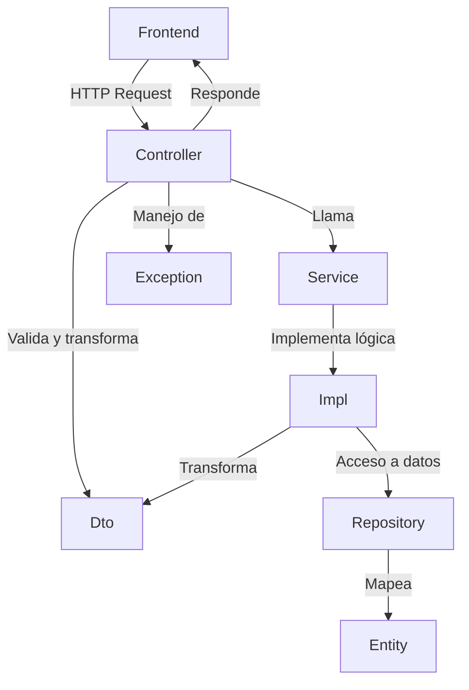

# Arquitectura del Sistema de Gestión para Conjunto Residencial

## Estructura de Carpetas (Spring Boot)

```
📁 src/main/java/com/exe/ConjuntoResidencialArkania/
│
├── Entity/         # Modelos, representación de tablas en BD
├── Dto/            # Objetos de transferencia de datos
├── Repository/     # Interfaces JPA/Hibernate
├── Service/        # Interfaces de lógica de negocio
├── Impl/           # Implementaciones concretas de los servicios
├── Controller/     # Controladores REST
├── Config/         # Configuración (seguridad, CORS, BD, etc.)
├── Exception/      # Manejo de excepciones personalizadas
```

### Descripción de Carpetas

- **Entity**: Clases que representan las entidades del sistema y se mapean a tablas de la base de datos.
- **Dto**: Clases para transferir datos entre backend y frontend, evitando exponer entidades directamente.
- **Repository**: Interfaces que extienden JpaRepository/Hibernate para acceso a datos.
- **Service**: Interfaces que definen la lógica de negocio.
- **Impl**: Implementaciones concretas de los servicios definidos en Service.
- **Controller**: Clases que exponen endpoints REST y gestionan las peticiones HTTP.
- **Config**: Clases de configuración (seguridad, CORS, base de datos, etc.).
- **Exception**: Clases para manejo de excepciones personalizadas y validaciones.

---

## Módulos y Clases por Carpeta

### 1. Usuarios y Roles

- **Entity**: UserEntity, RolEntity, UsuarioRol
- **Dto**: UserDto, RolDto
- **Repository**: UserRepository, RolRepository, UsuarioRolRepository
- **Service**: UserService, RolService
- **Impl**: UserServiceImpl, RolServiceImpl
- **Controller**: UserController, RolController
- **Config**: SecurityConfig, JwtConfig
- **Exception**: UserNotFoundException, RoleNotFoundException

### 2. Apartamentos y Parqueaderos

- **Entity**: ApartamentoEntity, ParqueaderoEntity
- **Dto**: ApartamentoDto, ParqueaderoDto
- **Repository**: ApartamentoRepository, ParqueaderoRepository
- **Service**: ApartamentoService, ParqueaderoService
- **Impl**: ApartamentoServiceImpl, ParqueaderoServiceImpl
- **Controller**: ApartamentoController, ParqueaderoController
- **Exception**: ApartamentoNotFoundException, ParqueaderoNotFoundException

### 3. Reservas de Áreas Comunes

- **Entity**: AreaComunEntity, ReservaEntity
- **Dto**: ReservaDto, AreaComunDto
- **Repository**: ReservaRepository, AreaComunRepository
- **Service**: ReservaService, AreaComunService
- **Impl**: ReservaServiceImpl, AreaComunServiceImpl
- **Controller**: ReservaController, AreaComunController
- **Exception**: ReservaNotFoundException, AreaComunNotFoundException

### 4. Correspondencia

- **Entity**: CorrespondenciaEntity
- **Dto**: CorrespondenciaDto
- **Repository**: CorrespondenciaRepository
- **Service**: CorrespondenciaService
- **Impl**: CorrespondenciaServiceImpl
- **Controller**: CorrespondenciaController
- **Exception**: CorrespondenciaNotFoundException

### 5. Solicitudes/Novedades

- **Entity**: SolicitudEntity, NovedadEntity
- **Dto**: SolicitudDto, NovedadDto
- **Repository**: SolicitudRepository, NovedadRepository
- **Service**: SolicitudService, NovedadService
- **Impl**: SolicitudServiceImpl, NovedadServiceImpl
- **Controller**: SolicitudController, NovedadController
- **Exception**: SolicitudNotFoundException, NovedadNotFoundException

### 6. Seguridad y Permisos

- **Config**: SecurityConfig, JwtConfig, CorsConfig
- **Entity**: PermisoEntity
- **Dto**: PermisoDto
- **Repository**: PermisoRepository
- **Service**: PermisoService
- **Impl**: PermisoServiceImpl
- **Controller**: PermisoController
- **Exception**: PermisoNotFoundException, UnauthorizedException

### 7. Notificaciones

- **Entity**: NotificacionEntity
- **Dto**: NotificacionDto
- **Repository**: NotificacionRepository
- **Service**: NotificacionService
- **Impl**: NotificacionServiceImpl
- **Controller**: NotificacionController
- **Exception**: NotificacionNotFoundException

---

## Flujo de Datos

1. **Controller** recibe la petición HTTP (ej. POST /usuarios).
2. Valida y transforma el request en un **Dto**.
3. Llama al **Service** correspondiente.
4. El **ServiceImpl** implementa la lógica y usa el **Repository** para interactuar con la base de datos y las **Entity**.
5. El resultado se transforma en un **Dto** y se retorna al Controller.
6. El **Controller** responde al frontend con el **Dto**.
7. Las **Exception** personalizadas gestionan errores y validaciones, devolviendo respuestas claras al frontend.

---

## Diagrama Lógico (Mermaid)



---

## Endpoints Principales por Módulo

### Usuarios y Roles

- `POST /usuarios` → Crear usuario
- `GET /usuarios` → Listar usuarios
- `GET /usuarios/{id}` → Obtener usuario
- `PUT /usuarios/{id}` → Actualizar usuario
- `DELETE /usuarios/{id}` → Eliminar usuario
- `POST /roles` → Crear rol
- `GET /roles` → Listar roles

### Apartamentos y Parqueaderos

- `POST /apartamentos` → Crear apartamento
- `GET /apartamentos` → Listar apartamentos
- `POST /parqueaderos` → Crear parqueadero
- `GET /parqueaderos` → Listar parqueaderos

### Reservas de Áreas Comunes

- `POST /reservas` → Crear reserva
- `GET /reservas` → Listar reservas
- `GET /areas-comunes` → Listar áreas comunes

### Correspondencia

- `POST /correspondencias` → Registrar correspondencia
- `GET /correspondencias` → Listar correspondencias
- `PUT /correspondencias/{id}/entregar` → Marcar como entregada

### Solicitudes/Novedades

- `POST /solicitudes` → Registrar solicitud/novedad
- `GET /solicitudes` → Listar solicitudes/novedades

### Seguridad y Permisos

- `POST /login` → Autenticación
- `GET /permisos` → Listar permisos
- `POST /permisos` → Crear permiso

### Notificaciones

- `POST /notificaciones` → Enviar notificación
- `GET /notificaciones` → Listar notificaciones

---

## Consideraciones Técnicas

- **Spring Boot** con **JPA/Hibernate** para persistencia.
- **Autenticación y autorización** con **JWT** o **Spring Security**.
- **Validaciones** con `javax.validation` en Dto y Entity.
- **Arquitectura limpia**: separación de capas, uso de Dto, manejo de excepciones, servicios desacoplados.

---

Este documento sirve como guía base para el desarrollo de un sistema robusto y escalable para la gestión de conjuntos residenciales.
