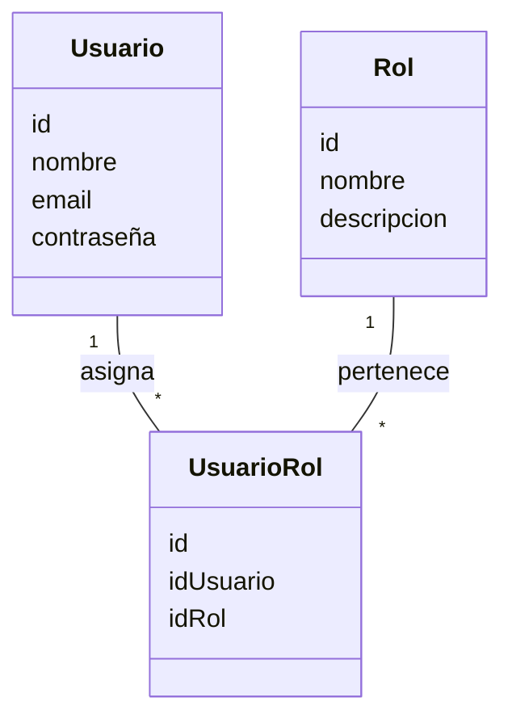

# Documentación Técnica y de Proyecto

## Módulos: Usuario, Rol y UsuarioRol

---

## 1. Estructura de Carpetas

### Backend (`/backend`)

```
src/
  main/
    java/
      com/
        exe/
          ConjuntoResidencialArkania/
            Entity/
              UserEntity.java
              RolEntity.java
              UsuarioRolEntity.java
            DTO/
              UserDTO.java
              RolDTO.java
              UsuarioRolDTO.java
            Controller/
              UserController.java
              RolController.java
              UsuarioRolController.java
            Service/
              UserService.java
              RolService.java
              UsuarioRolService.java
            Repository/
              UserRepository.java
              RolRepository.java
              UsuarioRolRepository.java
    resources/
      application.properties
```

### Frontend (`/frontend`)

```
src/
  pages/
    UsersPage.tsx
    RolesPage.tsx
    UserRolesPage.tsx
  services/
    userService.ts
    roleService.ts
    userRoleService.ts
  contexts/
    AuthContext.tsx
  components/
    ui/
      Table.tsx
      Modal.tsx
      Input.tsx
      Button.tsx
```

---

## 2. Descripción de Entidades

### Usuario (`UserEntity`)

- Representa a los usuarios del sistema (residentes, visitantes, administradores, seguridad).
- Atributos principales: id, nombre, email, contraseña, estado, etc.

### Rol (`RolEntity`)

- Define los roles disponibles (residente, visitante, administrador, seguridad).
- Atributos principales: id, nombre, descripción.

### UsuarioRol (`UsuarioRolEntity`)

- Relaciona usuarios con roles, permitiendo asignar múltiples roles a un usuario.
- Atributos principales: id, idUsuario, idRol.

---

## 3. API REST (Backend)

### Usuario

- `GET /users` — Listar usuarios
- `POST /users` — Crear usuario
- `PUT /users/{id}` — Actualizar usuario
- `DELETE /users/{id}` — Eliminar usuario

### Rol

- `GET /roles` — Listar roles
- `POST /roles` — Crear rol
- `PUT /roles/{id}` — Actualizar rol
- `DELETE /roles/{id}` — Eliminar rol

### UsuarioRol

- `GET /usuario-roles` — Listar asignaciones usuario-rol
- `POST /usuario-roles` — Asignar rol a usuario
- `DELETE /usuario-roles/{id}` — Eliminar asignación

---

## 4. Servicios Frontend

- `userService.ts`: Consume los endpoints de usuario.
- `roleService.ts`: Consume los endpoints de rol.
- `userRoleService.ts`: Consume los endpoints de usuario-rol.

Ejemplo de consumo (fetch):

```typescript
// userService.ts
export const getUsers = async () => {
  return fetch("/api/users").then((res) => res.json());
};
```

---

## 5. Relación entre Módulos

- Un Usuario puede tener uno o varios Roles (relación N:M).
- UsuarioRol es la tabla intermedia que gestiona las asignaciones.
- Los roles determinan los permisos y accesos en la plataforma.

---

## 6. Flujo de Conexión Frontend-Backend

1. El frontend realiza peticiones HTTP (fetch/axios) a los endpoints REST del backend.
2. El backend responde con datos en formato JSON.
3. Los datos se muestran en tablas, formularios y componentes en el frontend.
4. Las acciones de crear, editar y eliminar se reflejan en ambos lados.

---

## 7. Diagrama Entidad-Relación



---

## 8. Ejemplo de Uso en Frontend

- `UsersPage.tsx`: Muestra la lista de usuarios y permite crear/editar.
- `RolesPage.tsx`: Muestra roles y permite gestionarlos.
- `UserRolesPage.tsx`: Permite asignar roles a usuarios.

Ejemplo de asignación de rol:

```typescript
// userRoleService.ts
export const assignRoleToUser = async (userId: number, roleId: number) => {
  return fetch("/api/usuario-roles", {
    method: "POST",
    headers: { "Content-Type": "application/json" },
    body: JSON.stringify({ userId, roleId }),
  }).then((res) => res.json());
};
```

---

## 9. Seguridad y Autenticación

- Los usuarios se autentican y reciben un token (JWT).
- Los roles determinan el acceso a funcionalidades específicas.
- El frontend almacena el token y lo envía en cada petición protegida.

Ejemplo de autenticación:

```typescript
// authService.ts
export const login = async (email: string, password: string) => {
  return fetch("/api/auth/login", {
    method: "POST",
    headers: { "Content-Type": "application/json" },
    body: JSON.stringify({ email, password }),
  }).then((res) => res.json());
};
```

---

## 10. Resumen

Estos módulos son la base para la gestión de usuarios y permisos en el sistema. La estructura modular y la separación clara entre backend y frontend facilitan la escalabilidad y el mantenimiento.

---

## 11. Ejemplo de Configuración de Conexión

En el frontend, configura la URL base para las peticiones:

```typescript
// utils/config.ts
export const API_BASE_URL = "http://localhost:8080/api";
```

En los servicios:

```typescript
// userService.ts
import { API_BASE_URL } from "../utils/config";
export const getUsers = async () => {
  return fetch(`${API_BASE_URL}/users`).then((res) => res.json());
};
```

---

## 12. Buenas Prácticas

- Usar DTOs para transferir datos entre backend y frontend.
- Validar datos en ambos lados.
- Proteger los endpoints sensibles con autenticación y autorización.
- Mantener la documentación actualizada.

---

## 13. Referencias

---

## 14. Login y Autenticación de Usuarios

### Backend

- **Endpoint de Login:**

  - `POST /auth/login`
  - Recibe: `{ email, password }`
  - Responde: `{ token, user, roles }`
  - El backend valida las credenciales, genera un JWT y lo retorna junto con la información del usuario y sus roles.

- **Validación de Token:**
  - Los endpoints protegidos requieren el header `Authorization: Bearer <token>`.
  - El backend valida el token en cada petición y permite el acceso según los roles del usuario.

### Frontend

- **Servicio de Login:**

  - Ubicación: `src/services/authService.ts`
  - Ejemplo:
    ```typescript
    export const login = async (email: string, password: string) => {
      return fetch("/api/auth/login", {
        method: "POST",
        headers: { "Content-Type": "application/json" },
        body: JSON.stringify({ email, password }),
      }).then((res) => res.json());
    };
    ```

- **Gestión de Sesión:**

  - El token recibido se almacena en `localStorage` o `sessionStorage`.
  - El contexto de autenticación (`AuthContext.tsx`) gestiona el estado del usuario y el token.
  - El token se envía en el header de cada petición protegida.

- **Protección de Rutas:**

  - Las páginas que requieren autenticación verifican la existencia y validez del token antes de mostrar el contenido.
  - Si el usuario no está autenticado, se redirige a la página de login.

- **Logout:**
  - El usuario puede cerrar sesión, lo que elimina el token y limpia el estado de autenticación.
